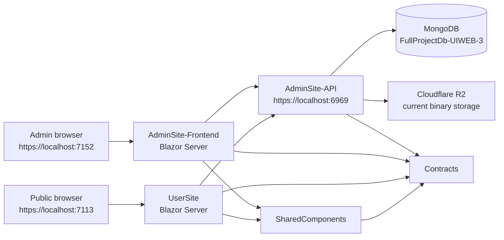

# UIWEB CMS: Complete Project Handoff

Last reconciled: 2026-07-06
Active workspace: `F:\0-Project\Test1\0-AdminSite-CompleteProject`  
Active branch at reconciliation: `Indev3-Overhaul3`

This documentation set is the current orientation source for a new developer or a new Codex session. It supersedes the old handoff files for current status, but the old files remain useful as historical evidence.

## 1. Read This First

Before changing anything:

```powershell
git branch --show-current
git status --short
```

The worktree was intentionally dirty when this handoff was written. It contained the in-progress BlockOverhaul-3 implementation across API, Contracts, AdminSite, SharedComponents, JavaScript, CSS, and clone-test tooling. Do not discard, reset, or overwrite those changes.

Read the files in this order:

1. [00-START-HERE.md](00-START-HERE.md)
2. [01-PRODUCT-HISTORY-AND-DIRECTION.md](01-PRODUCT-HISTORY-AND-DIRECTION.md)
3. [02-ARCHITECTURE-AND-MODULES.md](02-ARCHITECTURE-AND-MODULES.md)
4. [03-DATA-WORKFLOWS-AND-INVARIANTS.md](03-DATA-WORKFLOWS-AND-INVARIANTS.md)
5. [04-FEATURE-STATUS-AND-ROADMAP.md](04-FEATURE-STATUS-AND-ROADMAP.md)
6. [05-REFERENCES-AND-MIGRATION.md](05-REFERENCES-AND-MIGRATION.md)
7. [06-DEVELOPMENT-OPERATIONS-AND-SECURITY.md](06-DEVELOPMENT-OPERATIONS-AND-SECURITY.md)
8. [07-BLOCKOVERHAUL-3-UX-CORRECTION-PLAN.md](07-BLOCKOVERHAUL-3-UX-CORRECTION-PLAN.md)
9. [08-BLOCK-EDITOR-REDESIGN-ACCEPTANCE.md](08-BLOCK-EDITOR-REDESIGN-ACCEPTANCE.md)

## 2. Source-Of-Truth Hierarchy

When documents disagree, use this order:

1. The current user instruction.
2. Current branch and current source code.
3. Current MongoDB data when the task concerns existing Pages or migration.
4. This handoff set.
5. Feature-specific current plans.
6. Old handoffs and conversation exports.
7. Demo projects.

Old files such as `LibraryFeature_9Phase_Handoff.md` correctly describe the original decisions, but their branch names and phase status are obsolete.

## 3. Project In One Paragraph

UIWEB is a .NET 8, Blazor Server, MongoDB-backed content-management system and public website. It has an administrative Page Builder, Content Management, Form Management, Resource Library, user and role management, global Theme/Branding/Footer/Social settings, shared public renderers, and a draft/published page graph. Cloudflare R2 currently stores uploaded binary assets while MongoDB stores URLs, storage keys, ownership metadata, content, layouts, and references. The long-term direction is to make Pages data-driven through Sections, Blocks, CanvasSection, reusable presets, and shared renderers, while progressively retiring eligible handcrafted HTMLSection compositions.

## 4. Runtime Topology



## 5. Main Projects

| Folder | Responsibility |
| --- | --- |
| `AdminSite-API` | REST API, MongoDB models and services, authentication, authorization, workflows, uploads, public page assembly. |
| `AdminSite-Frontend` | Administrative dashboard, Page Builder, editors, Content/Form/Resource management, preview iframe and authoring overlays. |
| `UserSite` | Public navigation, page/content routes, language state, API client and public form submission. |
| `SharedComponents` | One shared Page/Section/Block renderer used by UserSite and Admin Preview, plus shared CSS and widget JavaScript. |
| `Contracts` | Shared Admin, Public, Auth, Form, Global and API DTO boundaries. |
| `Tool/Tool For Demo Import` | User-operated one-click demo database importer. |
| `Tool/Tools For Page Graph Clone Testing` | Explicit page graph clone coverage tool. |
| `AI-Tools` | Developer/AI maintenance scripts, audits and one-off migration helpers; not ordinary user tooling. |

## 6. Core Product Principles

These decisions must not be casually reversed:

1. **Draft and published data are separate.** Admin edits draft records. UserSite reads published records.
2. **StableId is graph identity.** Mongo `_id` identifies a document instance; `StableId` connects draft, published, revision and clone meaning.
3. **Admin Preview and UserSite share renderers.** Fix parity in shared rendering or data mapping, not with isolated visual patches.
4. **Content Type Behavior is authoritative.** Page, FileResource, VideoResource, ImageResource and Gallery govern editor fields, validation, preview and LibrarySection behavior.
5. **Direct Upload and Managed Resource are different paths.** Not every upload belongs in Resource Library.
6. **Resource deletion is usage-aware and server-authoritative.** The UI hint is not the safeguard.
7. **Deleted Form fields stay deleted.** Submission handling is definition-driven; JavaScript must not invent fields.
8. **Form Key and Field Key are identities, not labels.** Saved keys are locked; labels remain editable.
9. **Viewer cannot access Resource Library or Form Management.** Writer can view Resource Library. Backend permissions remain authoritative.
10. **HTMLSection is transitional, not forbidden.** Keep advanced visual-only compositions until Blocks can reproduce them safely.
11. **New Block types are gated.** Add one only when the existing Blocks and layout contracts cannot represent the required data or interaction.
12. **Containers are layout structures.** The current UX correction direction makes them invisible by default and governed through Collection/Composition behavior.

## 7. Current State Snapshot

MongoDB inventory captured on 2026-07-02:

| Collection | Count |
| --- | ---: |
| `pages_draft` | 33 |
| `pages_published` | 32 |
| `sections_draft` | 72 |
| `sections_published` | 69 |
| `blocks_draft` | 23 |
| `blocks_published` | 5 |
| `canvas_section_presets` | 0 |

Draft Sections include 22 HTMLSections and 2 CanvasSections. Draft Blocks are concentrated in `solutions`, `solutions/custom-brokerage`, `insights`, and the `test-2` sandbox. This confirms that the Block system is architecturally advanced but has not yet replaced most real page HTML.

The `test-2` Page is the current safe Block migration sandbox. Do not use bulk automatic page conversion. Work one reference Section at a time and compare desktop and mobile behavior.

## 8. Current Development Focus

The active feature is **BlockOverhaul-3**.

Implemented in the current dirty worktree, pending full closure:

- unified Block contracts;
- responsive composition contracts;
- shared rendering foundation;
- responsive authoring controls;
- appearance and shape system;
- expanded Container layouts;
- diagram decorations and connectors;
- animation contracts and renderer;
- media/functional Block completion;
- Canvas authoring commands;
- preset governance.

Still remaining from the original 17 phases:

- reference preset library;
- strict new Block type gate audit;
- page-by-page HTML migration;
- responsive/accessibility/workflow compatibility verification;
- legacy cleanup and documentation.

A second UX correction plan was agreed after real use showed that the Block Editor exposed too many raw controls. That full plan and its per-phase implementation status are in [07-BLOCKOVERHAUL-3-UX-CORRECTION-PLAN.md](07-BLOCKOVERHAUL-3-UX-CORRECTION-PLAN.md); underlying contracts alone are never evidence of UX completion.

As of 2026-07-06, the earlier UX correction phases and the newer ten-phase Block Editor redesign are implemented in the active worktree. The redesign now uses Preview/Edit as the only global modes, launches Arrange Blocks from a specific Section's Blocks tab, scopes the Block list to that Section, persists governed Container presets/slots, enforces containment, and gives Container deletion an explicit recursive warning. Phase 9 was completed through the user-approved no-data path: no bulk Test-2 migration was run because Test-2 contains no migration-worthy content, while legacy Containers remain compatible through `legacy-freeform`. See [08-BLOCK-EDITOR-REDESIGN-ACCEPTANCE.md](08-BLOCK-EDITOR-REDESIGN-ACCEPTANCE.md) for the phase-by-phase acceptance record.

## 9. User Collaboration Rules

- If the user says "do not code," investigate and discuss only.
- Follow plans in phase order. Do not jump ahead because a later task looks easier.
- For database-based visual migration, work slowly, one Page and one Section at a time.
- Never replace the original reference Section while prototyping; use the designated test Page.
- Do not touch copied repos or the SVN mirror unless explicitly asked.
- Do not revert unrelated dirty changes.
- Explain architecture implications before broad model, DTO or workflow changes.
- Prefer a real service/file split over partial-class cosmetic splitting.
- Keep operational tools under `Tool`; keep disposable maintenance scripts under `AI-Tools`.

## 10. Known Warnings

- `Models.cs`, `AdminDtos.cs`, large Razor editors and `sc-components.css` still need structural splitting.
- Admin JWT is stored in browser `localStorage`; backend authorization exists, but XSS could expose the token. Secure HttpOnly cookie migration remains future work.
- R2 secrets and JWT secrets must not be committed in real deployment configuration.
- Antivirus, quarantine and archive-bomb scanning are not implemented.
- Audit/Login Log Overhaul is deliberately deferred and must not be mixed into unrelated work.
- No general CI pipeline or Dockerfile currently defines automated delivery.
- Physical phone rendering can differ from a width-only iframe preview.
- The old resource and library markdown contains superseded UI details, especially multilingual resource names and old two-pane layouts.

## 11. Definition Of "Complete"

A feature is not complete merely because it builds. Completion requires:

1. API validation and authorization.
2. Admin UI behavior and error states.
3. Shared renderer or UserSite behavior where applicable.
4. Draft/publish/reset/clone compatibility.
5. MongoDB old-document compatibility.
6. English/Vietnamese UI verification where touched.
7. Desktop/tablet/mobile verification where visual.
8. Focused tests or an explicit statement that testing remains manual.
9. Updated source-of-truth documentation.
