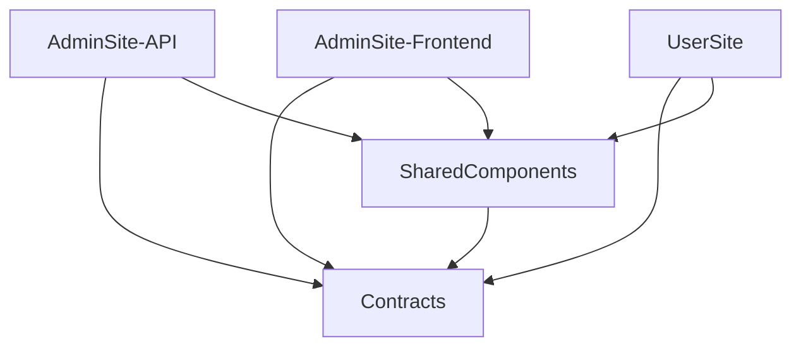

# Architecture And Modules

Last reconciled: **2026-07-16**

## 1. Technology Stack

| Area | Technology |
| --- | --- |
| Runtime | .NET 8 |
| API | ASP.NET Core Web API, controllers, middleware, rate limiting |
| Admin UI | Blazor Server plus Razor Pages for login/logout; DevExpress Blazor; Blazored.Toast |
| Public UI | Blazor Server |
| Database | MongoDB Driver 2.25; replica-set-compatible transactions where required |
| Admin authentication | API JWT + database session; JWT carried inside encrypted AdminSite authentication cookie |
| Password hashing | BCrypt |
| Upload storage | Cloudflare R2 through asset/storage service abstractions |
| Shared rendering | Razor Class Library (`SharedComponents`) |
| Shared contracts | .NET class library (`Contracts`) |
| Browser behavior | JavaScript for Canvas overlays, sorting, inline rich text, Form design width drag, modal delegation, maps, animation, and diagrams |
| API documentation | Swagger/Swashbuckle in Development |
| HTML security | HtmlSanitizer plus project URL/content policies |

`Blazored.LocalStorage` remains registered only for non-secret UI preferences such as Admin language. Authentication no longer reads or writes localStorage.

## 2. Dependency Direction



- `Contracts` must not depend on UI or API implementation.
- `SharedComponents` owns public rendering but not persistence.
- Admin Preview and UserSite should consume the same Public DTOs.
- API models are BSON persistence types; do not bind them directly as public contracts.

## 3. AdminSite-API

### 3.1 Startup And Cross-Cutting Infrastructure

Primary file: `AdminSite-API/Program.cs`.

It configures:

- MongoDB client/database and typed context;
- API services and policies;
- public-form and admin-login rate limiting;
- JWT bearer validation;
- permission policies generated from `AdminPermissionKeys.All`;
- authenticated fallback authorization;
- CORS policy `AllowFrontends`;
- JSON enum conversion and null omission;
- global exception filtering;
- session validation middleware;
- Swagger in Development;
- Mongo indexes;
- startup cleanup/default Form type/definition migrations;
- dynamic role initialization and legacy permission migration;
- optional demo Admin seeding.

Known gap: public metrics/page-view mutations do not yet have a dedicated `public-metrics` limiter. Public Form submission endpoints are rate-limited.

### 3.2 MongoDB Collections

`AdminSite-API/Data/MongoDbContext.cs` exposes important typed boundaries:

- `pages_draft`, `pages_published`, `page_revisions`;
- `sections_draft`, `sections_published`;
- `blocks_draft`, `blocks_published`;
- `canvas_section_presets`;
- `admin_users`, `admin_roles`, `admin_sessions`, `admin_login_activity`, `admin_audit_logs`;
- `form_definitions`, `form_submissions`;
- `content_draft`, `content_published`, `content_types`, `content_revisions`, `content_audit_logs`;
- `managed_resources`, `resource_albums`;
- `visitor_metrics`;
- `site_settings`, `branding`.

Theme/Footer/Social/Global Button services may use their own collection bindings. Inspect the service rather than assuming every collection appears in the context.

### 3.3 Controller Inventory

| Controller | Responsibility |
| --- | --- |
| `AuthController` | API login/logout/current session/password update and session validity. |
| `AdminUsersController` | Users, account state, password reset, sessions, login activity, account permission results. |
| `AdminRolesController` | Role list/create/update/impact/delete with reassignment. |
| `PagesController` | Page CRUD, order, visibility/access, revision, publish, reset. |
| `ChildPageController` | Child Page CRUD, card overrides, order, visibility/access. |
| `SectionsController` | Section CRUD, style, visibility, order. |
| `BlocksController` | Block CRUD, layout, reorder, duplication, locks, recursive graph deletion, governed Container/Form rules. |
| `CanvasSectionPresetsController` | Universal saved Section preset capture/list/apply/delete. |
| `ContentController` | Content CRUD, scopes, workflow transitions, revisions, audit, Content Types. |
| `ManagedResourcesController` | Resource/Album browse, upload, batch, replacement, usage, deletion. |
| `FormsController` | Definitions, design, fields, built-in input types, submissions, assignment/status/export. |
| `PublicFormsController` | Public Form lookup by key/id and definition-driven submit. |
| `PublicController` | Public navigation, Pages, Content, metadata, legacy Form routes, download metrics. |
| `BrandingController`, `ThemeController`, `FooterController`, `SocialController`, `GlobalButtonsController` | Global public configuration. |
| `SettingsController` | Languages, Admin appearance, Resource limits, glossary, public Admin language/appearance surface. |
| `VisitorMetricsController` | Admin activity reporting. |

Every protected endpoint must enforce backend authorization. Hidden navigation is presentation only.

### 3.4 Page, Section, Block, And Preset Services

Key services:

- `PagesServices.cs`: Page CRUD and hierarchy behavior;
- `SectionServices/SectionServices.cs`: polymorphic Section persistence/normalization;
- `BlockService.cs`: type-specific Block updates, layout, order, containment, geometry, Form baseline, assets;
- `BlockServices/BlockContractService.cs`: appearance/responsive/animation/Container validation;
- `BlockServices/BlockAuthoringService.cs`: geometry/duplicate authoring commands; obsolete Group/Ungroup paths were removed;
- `BlockServices/BlockAssetMetadataService.cs`: Direct/Managed asset normalization;
- `BlockServices/ContainerDiagramContractService.cs`: connector/decoration contracts;
- `Models/Blocks/BlockAuthoringPolicy.cs`: authoring policy helpers;
- `SectionServices/CanvasSectionPresetService.cs`: universal Section/Block graph capture and apply;
- `SectionServices/CanvasPresetContractService.cs`: preset compatibility and governance.

The persistence discriminator still calls the saved Section collection `canvas_section_presets`, but the UI feature saves supported normal Sections as complete reusable presets, not only bare Canvas Block layouts.

The current `ColumnsSection` name remains in source and persisted type
discriminators. The proposed product name is **Split Section**. Redesign the
behavior first, keep the persisted `columns` discriminator compatible, and
decide any coordinated class/DTO rename only after the new contract is frozen.

Saved preset preview is intentionally metadata-driven:

- Section icon;
- preset name and description;
- Section type/item summary;
- dark Theme-colored thumbnail outline;
- hover treatment on the outer preset card.

It does not generate a pixel screenshot. Earlier PageRenderer thumbnail attempts were rejected because complex grids/HTML/custom CSS rendered misleadingly.

### 3.5 Publish, Reset, Revision, And Clone

Services:

- `PublishAndResetService/PublishService.cs`;
- `PublishAndResetService/ResetService.cs`;
- `CloneServices/MongoDocumentCloneService.cs`;
- `CloneServices/PageGraphCloneService.cs`;
- `CloneServices/PageGraphPublishDiffService.cs`;
- `CloneServices/CloneProfile.cs`.

Clone profiles:

| Profile | Meaning |
| --- | --- |
| `PublishSnapshot` | Draft graph to published graph. |
| `DraftResetSnapshot` | Published graph back to editable draft. |
| `DuplicateAsNewContent` | Independent graph with regenerated stable identity. |
| `PresetCapture` | Store reusable Section/Block data without source-page identity. |
| `PresetApply` | Regenerate/remap identity into a target Page. |

The publish UI remains Page-level. Granular insert/update/delete/unchanged behavior is internal.

Page revision persistence and restore endpoints exist, but the complete Admin
timeline/preview/comparison/restore experience is future work. Asset retention
must be audited before revision restore is promoted broadly.

### 3.6 Dynamic Roles And Authentication Services

Core API services:

- `AdminRoleService`;
- `AuthService` in `AuthServices.cs`;
- `AdminSessionValidationMiddleware`;
- `Security/AdminAuthorization.cs`.

`AdminRoleService`:

- initializes AdminAdmin, Manager, Writer, and Viewer only when role storage is empty;
- keeps AdminAdmin full-access, protected, and system-owned;
- makes Manager/Writer/Viewer ordinary editable/deletable roles;
- normalizes legacy enum role storage;
- migrates old Manage/Publish/Delete Content permissions one way;
- links old users to role records;
- computes effective role + extra permissions;
- increments token versions and revokes sessions after security-relevant mutations;
- requires reassignment when deleting an assigned role.

Current Login Activity and Audit Log storage/UI exist, but their governance is
not the accepted long-term design. The planned Log Overhaul will establish:

- separate Login Activity and Audit Trail responsibilities;
- structured actor/action/target/result/context events;
- retention, archive and export;
- safe filtering without raw exception exposure;
- removal of casual permanent bulk deletion;
- an event foundation reusable by Page revisions, upload scanning, asset cleanup
  and later persistent notifications.

### 3.7 Content Module

Services:

- `ContentTypeService`;
- `ContentValidationService`;
- `ContentWorkflowService`;
- `ContentRevisionService`;
- `ContentMappingService`;
- `ContentAssetMetadataService`;
- `ContentService` orchestration facade;
- `Security/ContentWorkflowPolicy.cs` for visibility and action authorization.

Behavior values remain `Page`, `FileResource`, `VideoResource`, `ImageResource`, and `Gallery`.

The current policy is not a generic CRUD permission check. It combines role permissions, ownership, status, review sub-status, and requested list scope.

### 3.8 Resource And Asset Module

- `ManagedResourceService`;
- `ManagedResourceAlbumService`;
- `ManagedResourceValidationService`;
- `ManagedResourceUsageService`;
- `ManagedResourceReferenceHelper`;
- `AssetReferenceService`;
- `AssetCleanupService`;
- `R2AssetService` and `R2StorageService`.

One Resource belongs to zero or one Album and may be referenced by many records. Asset cleanup must know every asset-bearing field before it can safely delete bytes.

Current cleanup is synchronous best-effort after successful owner mutations.
Known refinement work:

- Page revision snapshots are not currently part of
  `AssetReferenceService.IsReferencedAsync`;
- direct-upload asset recoverability across revision restore needs an explicit
  retention rule;
- failed R2 deletion is logged but has no durable retry/outbox state;
- orphan detection and reconciliation are not operational tools yet;
- publish/restore cleanup should use precise old-versus-current asset sets while
  retaining the global reference check as the final safety gate.

The clone architecture itself is not open redesign debt. Future clone work is
limited to coverage, preset stable-id policy and identity-sensitive extensions.

### 3.9 Form Module

Core services/policies:

- `FormDefinitionService`: definition/key/design ownership, schema-v2
  normalization, compatibility projection and propagation;
- `FormDefinitionOrderService`: server-authoritative definition order and
  revisioned reorder mutations;
- `FormDesignV2MigrationPlanner`: dry-run, lease, migration record and
  idempotent controlled conversion;
- `FormInputTypeService`: governed built-in types;
- `FormValidationService`: Admin definition/design validation;
- `Contracts/Forms/FormDesignPolicy.cs`: retained v1 compatibility dimensions
  and normalization;
- `Contracts/Forms/FormDesignV2Policy.cs`: Standard/SplitPanel/CTA layouts,
  explicit field rows, information items, actions, dimensions, gaps and
  calculated height;
- `Contracts/Forms/FormBlockLayoutPolicy.cs`: exact Block defaults and scale/Section limits;
- `PublicFormSubmissionHandler` and public Form service paths;
- `FormSubmissionService`;
- `FormSubmissionExportService`;
- `FormSubmissionSecurityService`;
- `FormFieldValidationRule`.

The current Form contract is:

```text
Form Definition
 |- locked Key
 |- localized Name/Introduction/Submit label
 |- ordered governed Fields
 \- one FormDesignSettings
       |- Standard | SplitPanel | CTA
       |- explicit FieldRows (1-3 compatible fields)
       |- optional InformationItems
       |- exactly one Submit + optional safe auxiliary actions
       \- width/split ratio + calculated height + visual tokens

Button/Card action/FormBlock
 \- FormDefinitionId only
```

`SharedComponents/PublicFormRenderer.razor` is canonical for embedded Forms,
User modal Forms, Admin modal previews and design previews.

V1 compatibility remains available for old documents and rollback. It is not
the active authoring contract and should be removed only after deployment
observation and explicit acceptance. The completed implementation sequence is
archived in `History/12-FORM-DESIGN-V2-REVISION-PLAN.md`.

## 4. Contracts

Main areas:

- `Admin/AdminDtos.cs`: legacy broad Admin DTO file;
- `Admin/Blocks/*`: authoring, appearance, asset, responsive, and diagram DTOs;
- `Public/PublicSectionDto.cs`, `Public/PublicBlockDto.cs`, `Public/PublicSharedDtos.cs`;
- `Public/Blocks/*`: split public Block contracts;
- `Forms/FormDtos.cs`, `FormDesignPolicy.cs`, `FormBlockLayoutPolicy.cs`, input validation;
- `Auth/AuthDtos.cs`: permission keys/dependencies, Admin-exclusive capability descriptions, login/session/user/role DTOs;
- `Global/GlobalDtos.cs`, `ThemeCssBuilder.cs`, `ThemeFontCatalog.cs`;
- `Api/ApiResponse.cs`.

The compatibility `AdminSite-API/Utils/ApiResponse.cs` surface and shared `Contracts.Api.ApiResponse<T>` include `NotificationKey` and `NotificationArgs` for localized feedback.

## 5. AdminSite-Frontend

### 5.1 Authentication Boundary

Admin login/logout are Razor Pages:

- `Components/Pages/AdminLogin.cshtml` and `.cs`;
- `Components/Pages/Auth/AdminLogout.cshtml` and `.cs`.

There is no `Login.razor`. Login/logout require full-page HTTP navigation because they create/delete the HttpOnly authentication cookie at the server boundary.

Services:

- `AdminApiAuthenticationClient` calls API authentication without using browser storage;
- `AdminAuthConstants` builds/reads the protected ticket claims;
- `AdminCookieAuthenticationEvents` redirects unauthenticated users to login and access-denied authenticated users to `/`;
- `AdminRevalidatingAuthenticationStateProvider` validates periodically;
- `AdminSessionInvalidationService` broadcasts account/session invalidation inside the process;
- `AdminSessionWatcher.razor` signs out invalid circuits.

### 5.2 Navigation And Permissions

`Shared/NavMenu.razor` projects `AdminAuthService` capabilities.

- Page Management is available to authenticated users for Preview.
- `page-builder` enables Edit/Arrange/mutation.
- Content nav requires `view-content`; action buttons require Create/Edit or Approve as appropriate.
- Form Definitions and Submissions use separate view/edit/manage/export permissions.
- UI permissions mirror API policies but never replace them.
- Access denied during direct URL navigation redirects to `/`; ordinary hidden modules are removed from nav to avoid confusion.

### 5.3 Page Builder

Core components:

- `Dashboard.razor`: root/child Page tabs, selection, Preview/Edit toggle;
- `Canvas.razor`: preview scaling, Section overlay, Arrange workspace, centered Block creation and modal hosts;
- `Preview.razor`: draft graph -> Public DTO mapping;
- `EditPanel.razor`: Section editor shell and Blocks tab;
- `SectionEditors/*`;
- `BlockEditors/*`;
- `CanvasAuthoring/CanvasArrangeToolbar.razor`.

Global modes:

- **Preview:** interactive draft rendering and desktop/tablet/mobile viewport selection;
- **Edit:** Section selection/editor and Page/Section actions.

Arrange is a Section-owned sub-workspace:

1. select a Section in Edit;
2. open its Blocks tab;
3. choose Arrange Blocks;
4. manipulate only that Section's Block graph;
5. choose Done Arranging to return to the same Section/Blocks context.

Desktop Canvas scale is 80%. Tablet/mobile use their existing 70% device-preview scale and fixed viewport widths; these are responsive viewport previews, not physical-device emulators.

### 5.4 Block Editing Ownership

- BlockEditor: content, files/resources, Form Definition, visibility, authoring name, locks/governance, delete.
- Arrange toolbar: selection/layer dropdown, add, shape/fill/border/animation, rotation, duplicate, locks, delete.
- Canvas handles: move/resize/zone targeting.
- Block dropdown: Section-scoped hierarchy and layer order.
- `EditorLabel`: private Block name; type-local untitled numbering is used when empty.

Text Block uses one starter and one rich editor with font, size, bold/italic/underline, combined list control, color, background, transparency, and alignment. The public Text Block renders only `Content`, never its authoring label.

### 5.5 Management Modules

- `Content/ContentItems.razor` and `ContentEditorShell.razor`;
- `Content/ContentResources.razor` and `ResourcePickerModal.razor`;
- `Forms/FormSubmissions.razor`, `FormDefinitions.razor`, `FormTypes.razor`;
- `Users/UserManagement.razor` with Users and Role Settings tabs;
- `Account/AccountManagement.razor` for own account/password and Admin account actions;
- `Users/LoginActivity.razor`, `AuditLogs.razor`;
- `Settings/Settings.razor`;
- `WebsiteActivity.razor`.

### 5.6 Translation Architecture

- `Languages/EnglishUIText.cs`;
- `Languages/VietnameseUIText.cs`;
- `Languages/ChineseUIText.cs`;
- `Languages/Core/UiTextCatalogBuilder.cs`;
- `Languages/Core/UiTextCatalogValidator.cs`;
- `Languages/Core/UiTextCatalogReport.cs`;
- `Services/AdminUiLocalizer.cs` small lookup facade.

Lookup order:

```text
requested compiled catalog
    -> configured fallback compiled catalog
    -> raw key
```

Translation Health is read-only and source-authoritative. Enabled languages without a compiled Admin UI catalog remain visible as unsupported.

### 5.7 Immediate Feedback Architecture

- `Services/Notifications/AdminFeedbackMessage.cs`;
- `AdminNotificationService.cs`;
- `AdminInlineFeedbackState.cs`;
- `Shared/Components/AdminInlineStatus.razor`;
- `wwwroot/css/admin/15-feedback.css`.

Most components call `Http.Notify`, `Http.NotifyInline`, or `Http.SilentSuccess`. The service resolves API notification keys, maps severity, suppresses routine success where explicitly requested, and keeps technical details out of ordinary messages. Toast host policy is top-right, four-second timeout, progress indicator, maximum three, remove on navigation.

This service is not a persistent database notification center.

### 5.8 Theme And Fonts

`ThemeFontCatalog` allowlists:

- Inter;
- Arial;
- Calibri;
- Times New Roman;
- Lexend;
- Roboto;
- Open Sans;
- Lato;
- Montserrat;
- Poppins;
- Noto Sans;
- Noto Serif.

Theme Settings places Body Font and Heading Font inside the Text section above size sliders. Only one picker should be open. Text Blocks may inherit Theme font or choose an allowlisted override. Category metadata is internal/catalog information, not a reason to stretch the picker UI.

## 6. SharedComponents

`PageRenderer.razor` delegates Public DTOs to Hero, CTA, List, HTML, Columns, Showcase, Library, Stats, Carousel, Network Map, Testimonial, and Canvas components.

`SectionBlocks.razor` owns Block frames, layout, responsive behavior, rotation/animation wrappers, Form scale variables, and polymorphic Block dispatch.

Current Block types:

1. Text
2. Image
3. Video
4. File
5. Map
6. Form
7. Card
8. Button
9. Metric
10. Bullet List
11. Step
12. Icon
13. Container

MapBlock and NetworkMapSection initialize Leaflet/OpenStreetMap through `cms-widgets.js`; the nested “Map” element is an initial/fallback placeholder, not the intended final rendering when Leaflet and tiles are available.

Shared JavaScript:

- `cms-widgets.js`: public modal delegation, maps, carousels, media, and retained HTML widgets;
- `block-animations.js`;
- `block-diagrams.js`;
- Admin `canvas.js`, `overlay.js`, and `form-design-editor.js`.

## 7. UserSite

UserSite remains thin:

- `MainLayout.razor`: Theme/Branding/navigation/language, header state, public Form modal host;
- `Index.razor`, `PageView.razor`, `ContentDetailView.razor`;
- `PublicApiService.cs`;
- `LanguageService.cs` with `localStorage["lang"]`;
- `ThemeService.cs`;
- `wwwroot/js/site-shell.js` for header and UI shell behavior.

Header behavior:

- at absolute top: dark header surface is transparent while logo/nav/language/login controls remain;
- scrolling down: the complete header slides out upward;
- scrolling upward: it slides back down;
- top state always restores visible transparent-header behavior.

UserSite must not duplicate Section/Block/Form markup owned by SharedComponents.

## 8. CSS Ownership

| CSS area | Owner |
| --- | --- |
| `AdminSite-Frontend/wwwroot/css/admin/*.css` | Admin shell, editors, modals, feedback, translation health, fonts, Form design, Canvas. |
| `SharedComponents/wwwroot/sc-components.css` | Shared public Sections/Blocks/Forms/modals/header. |
| `SharedComponents/wwwroot/css/html-sections/*.css` | Retained handcrafted HTMLSection visuals. |
| `SharedComponents/wwwroot/css/theme-typography.css` | Theme typography precedence. |

Do not add Razor scoped CSS for strict migration work. Do not put Page-family HTML styles in Admin CSS. Do not put executable scripts or CSS inside Mongo HTML content.

## 9. Structural Debt

Large files still include:

- `AdminSite-API/Models.cs`;
- `Contracts/Admin/AdminDtos.cs`;
- `AdminSite-Frontend/Models/AdminModels.cs`;
- `BlockEditor.razor`;
- `Canvas.razor`;
- `ContentEditorShell.razor`;
- `FormDefinitions.razor`;
- `SharedComponents/wwwroot/sc-components.css`;
- each language catalog.

Structural refactoring is planned in two passes:

1. targeted extraction of Section/Block policies and ownership before Split
   Section and Block Authoring Refinement;
2. consolidation after those behaviors stabilize.

Use real domain files/folders and preserve JSON/BSON contracts. Partial classes
that only hide file length are not the preferred solution.
