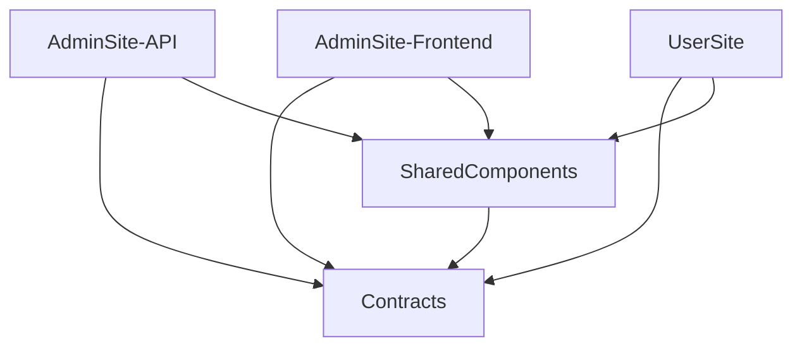

# Architecture And Modules

## 1. Technology Stack

| Area | Technology |
| --- | --- |
| Runtime | .NET 8 |
| API | ASP.NET Core Web API |
| Admin UI | Blazor Server, DevExpress Blazor, Blazored.LocalStorage, Blazored.Toast |
| Public UI | Blazor Server |
| Database | MongoDB Driver 2.25, replica-set-compatible connection |
| Authentication | JWT bearer, BCrypt password hashing, database session validation |
| Upload storage | Cloudflare R2 through asset/storage services |
| Shared rendering | Razor Class Library (`SharedComponents`) |
| Shared contracts | .NET class library (`Contracts`) |
| Browser behavior | JavaScript for iframe measurement, authoring overlays, sorting, forms, animation, diagrams and complex widgets |
| API documentation | Swagger/Swashbuckle |
| HTML security | HtmlSanitizer plus project security policies |

## 2. Dependency Direction

`Contracts` must not depend on UI or API implementation. `SharedComponents` owns public rendering but does not own persistence. AdminSite and UserSite should consume the same Public DTO shapes and shared renderers wherever possible.

## 3. AdminSite-API

### 3.1 Startup And Cross-Cutting Infrastructure

Primary file: `AdminSite-API/Program.cs`.

It configures:

- MongoDB client, database and context;
- service registrations;
- memory cache;
- public-form and admin-login rate limiting;
- JWT validation;
- permission policies;
- authenticated fallback authorization;
- JSON enum conversion;
- CORS for AdminSite and UserSite;
- Swagger;
- Mongo indexes;
- startup cleanup/default Form Type checks;
- optional demo admin seeding;
- session validation middleware;
- global exception filtering.

The API uses `FullProject` as its root namespace. The older parallel `GlobalManager` namespace was removed to restore one naming convention.

### 3.2 MongoDbContext

`AdminSite-API/Data/MongoDbContext.cs` exposes typed collection boundaries.

Important collections:

- `pages_draft`, `pages_published`, `page_revisions`;
- `sections_draft`, `sections_published`;
- `blocks_draft`, `blocks_published`, `canvas_section_presets`;
- `admin_users`, `admin_login_activity`;
- `form_definitions`, `form_submissions`;
- `content_draft`, `content_published`, `content_types`, `content_revisions`, `content_audit_logs`;
- `managed_resources`, `resource_albums`;
- `visitor_metrics`;
- `site_settings`, `branding`.

Some global services use their own collection names such as theme, footer, social and buttons. Always inspect the service before assuming every global collection is exposed through `MongoDbContext`.

### 3.3 Controller Inventory

| Controller | Responsibility |
| --- | --- |
| `AuthController` | Login, logout, current session and password update. |
| `AdminUsersController` | Users, roles/status, password reset, sessions, login activity and audit records. |
| `PagesController` | Page CRUD, visibility/access, ordering, revisions, publish and reset. |
| `ChildPageController` | Child Page CRUD, visibility/access, card overrides and ordering. |
| `SectionsController` | Section CRUD, style, visibility and order. |
| `BlocksController` | Block CRUD, layout, visibility, ordering, grouping, duplication, locks and graph deletion. |
| `CanvasSectionPresetsController` | Save, list, apply and delete Canvas presets. |
| `ContentController` | Content Types, Content CRUD, workflow, revisions and audit history. |
| `ManagedResourcesController` | Resource/album browse, CRUD, upload, batch upload, replacement, usage and deletion. |
| `FormsController` | Definitions, submissions, export, assignment/status, built-in Form-Field Types. |
| `PublicFormsController` | Public Form Definition lookup and definition-driven submission. |
| `PublicController` | Public navigation, Pages, Content, metadata, forms and download metrics. |
| `BrandingController`, `ThemeController`, `FooterController`, `SocialController`, `GlobalButtonsController` | Global website configuration. |
| `SettingsController` | Languages, admin appearance, Resource Library limits and glossary. |
| `VisitorMetricsController` | Administrative website activity reporting. |

All admin controllers must enforce backend permissions. Nav hiding is only presentation.

### 3.4 Page, Section And Block Services

Key services:

- `PagesServices.cs`: Page CRUD and Page-level model behavior.
- `SectionServices/SectionServices.cs`: polymorphic Section CRUD and normalization.
- `BlockService.cs`: Block persistence, type-specific updates, parent validation, reordering and resource cleanup.
- `BlockServices/BlockContractService.cs`: appearance, responsive, animation and Container contract normalization/validation.
- `BlockServices/BlockAuthoringService.cs`: bulk geometry, duplicate, group, ungroup and graph authoring operations.
- `BlockServices/BlockAssetMetadataService.cs`: Direct Upload/Managed Resource normalization for Block assets.
- `BlockServices/ContainerDiagramContractService.cs`: diagram contract validation and normalization.
- `SectionServices/CanvasSectionPresetService.cs`: captures and applies reusable Canvas graphs.
- `SectionServices/CanvasPresetContractService.cs`: preset compatibility and governance contracts.

The main polymorphic models remain in `Models.cs`, with newer Block contracts split into `AdminSite-API/Models/Blocks`. A full domain split of `Models.cs` remains future structural work.

### 3.5 Publish, Reset And Clone Architecture

Services:

- `PublishAndResetService/PublishService.cs`;
- `PublishAndResetService/ResetService.cs`;
- `CloneServices/MongoDocumentCloneService.cs`;
- `CloneServices/PageGraphCloneService.cs`;
- `CloneServices/PageGraphPublishDiffService.cs`;
- `CloneServices/CloneProfile.cs`.

The serializer-backed clone layer copies complete object data and then applies explicit identity/workflow rules. This prevents silent loss when a new Section or Block field is added.

Clone profiles:

| Profile | Meaning |
| --- | --- |
| `PublishSnapshot` | Draft graph to published identity. |
| `DraftResetSnapshot` | Published graph back to an editable draft. |
| `DuplicateAsNewContent` | Separate item with regenerated stable identity. |
| `PresetCapture` | Remove source-page dependency and store reusable layout data. |
| `PresetApply` | Regenerate/remap identities into a target Page. |

### 3.6 Content Module

The former large ContentService was split into focused services:

- `ContentTypeService`: type CRUD and behavior defaults;
- `ContentValidationService`: behavior-aware validation;
- `ContentWorkflowService`: submit/publish/delete/restore rules;
- `ContentRevisionService`: save, restore and trim revisions;
- `ContentMappingService`: model-to-response mapping;
- `ContentAssetMetadataService`: resource source/id/storage-key normalization;
- `ContentService`: orchestration facade;
- `ContentTypeWorkflow`: additional type workflow behavior.

Content behavior values:

- `Page`;
- `FileResource`;
- `VideoResource`;
- `ImageResource`;
- `Gallery`.

### 3.7 Resource Module

Services:

- `ManagedResourceService`: resource CRUD and orchestration;
- `ManagedResourceAlbumService`: album lifecycle, membership and hard-block deletion rules;
- `ManagedResourceValidationService`: kind, source, upload and metadata validation;
- `ManagedResourceUsageService`: reference discovery across the project;
- `ManagedResourceReferenceHelper`: mapping and shared reference operations;
- `AssetReferenceService`: global URL/storage-key reference discovery;
- `AssetCleanupService`: delete only when an asset has no remaining references;
- `R2AssetService` and `R2StorageService`: current provider implementation.

Albums are organizational metadata. One Resource belongs to at most one Album, but it can be used by many Pages, Sections, Blocks or Content records.

### 3.8 Form Module

Services:

- `FormDefinitionService`: Form schema and key governance;
- `FormInputTypeService`: built-in Form-Field Type definitions and parameters;
- `FormValidationService`: administrative definition validation;
- `PublicFormSubmissionService`: data-driven public validation and persistence;
- `FormSubmissionService`: administrative submission workflow;
- `FormSubmissionExportService`: Excel export;
- `FormSubmissionSecurityService`: honeypot, limits, cooldown and security checks;
- `FormFieldValidationRule`: field-level rules.

The public renderer and backend both read the active Form Definition. Deleted fields are not reconstructed from old JavaScript payload assumptions.

## 4. Contracts

`Contracts` is the serialization boundary between applications.

Main areas:

- `Admin/AdminDtos.cs`: legacy large Admin DTO file;
- `Admin/Blocks/*`: new split Block asset, authoring, appearance, responsive and diagram contracts;
- `Public/PublicSectionDto.cs`, `Public/PublicBlockDto.cs`, `Public/PublicSharedDtos.cs`;
- `Public/Blocks/*`: new split public Block contracts;
- `Forms/*`: Form DTOs, input types and shared input validation;
- `Auth/AuthDtos.cs`;
- `Global/GlobalDtos.cs`, `ThemeCssBuilder.cs`;
- `Api/ApiResponse.cs`.

Future work should continue splitting DTOs by domain without changing JSON contracts casually.

## 5. AdminSite-Frontend

### 5.1 Main Navigation

`Shared/NavMenu.razor` exposes modules according to `AdminAuthService` permissions:

- Dashboard/Page Builder;
- Theme and Global settings;
- Form Management: Submissions, Definitions, Types;
- Website Activity;
- Content Management: All, My, Submitted, Preview, Resource Library, Published, Deleted, Types, Templates;
- User Management: Users, Login Activity, Audit Logs;
- Settings.

Resource Library visibility is deliberately `Manager/AdminAdmin` or `Writer`; Viewer is excluded.

### 5.2 Page Builder

Core components:

- `Dashboard.razor`: page selection, parent/child navigation and mode state;
- `Canvas.razor`: iframe viewport, overlay, mode toolbar, selection and authoring operations;
- `Preview.razor`: loads draft Page/Sections/Blocks and maps them to Public DTOs;
- `EditPanel.razor`: Section editor shell;
- `SectionEditors/*`: Section-specific fields;
- `BlockEditors/*`: Block type content and contract editors;
- `CanvasAuthoring/CanvasArrangeToolbar.razor`: multi-selection authoring commands.

Modes:

- **Edit:** Section overlays and editor window;
- **Arrange:** Block geometry selection, drag/resize, alignment, distribution, layering and grouping;
- **Preview:** interactive page behavior without edit overlays.

### 5.3 Content, Resource And Form Management

- `Content/ContentItems.razor`: list surfaces and workflow views;
- `Content/ContentEditorShell.razor`: behavior-aware editor;
- `Content/ContentResources.razor`: unified Resource Library;
- `Content/ResourcePickerModal.razor`: lightweight in-context selection, not full management;
- `Forms/FormSubmissions.razor`, `FormDefinitions.razor`, `FormTypes.razor`;
- `WebsiteActivity.razor`.

Content Management, Form Submissions and Website Activity use the shared admin data-surface visual system in `wwwroot/css/admin/26-admin-data-surface.css`.

### 5.4 Language System

- Admin content language and Admin UI language are related but distinct concerns.
- English is currently the fallback language.
- Vietnamese and Chinese UI catalogs are source code files.
- Content dictionaries can contain enabled languages independently of Admin UI labels.
- Future work will split large language files into language-specific folders and add Translation Health reporting.
- Interactive database-backed translation editing is deferred.

## 6. SharedComponents

`PageRenderer.razor` pattern-matches Public Section DTO types and delegates to:

- Hero;
- CTA;
- List;
- HTML;
- Columns;
- Showcase;
- Library;
- Stats;
- Carousel;
- Network Map;
- Testimonial;
- Canvas.

`SectionBlocks.razor` renders Block frames, layout, responsive contracts, animation wrappers and polymorphic Block components.

Current Block types:

1. Text
2. Image
3. Video
4. File
5. Map
6. Form
7. Card
8. Button
9. Metric
10. Bullet List
11. Step
12. Icon
13. Container

Shared JavaScript:

- `cms-widgets.js`: public carousels, modals, sticky/interactive HTML scenes and modal forms;
- `block-animations.js`: Block motion initialization/replay/reduced-motion handling;
- `block-diagrams.js`: Container diagram geometry;
- Admin `canvas.js` and `overlay.js`: sorting, iframe measurement, geometry editing and preview patching.

## 7. UserSite

UserSite is intentionally thin:

- `MainLayout.razor`: branding, navigation, Theme, language exposure to JavaScript and global UI;
- `Index.razor`: home route;
- `PageView.razor`: root and child Page routes;
- `ContentDetailView.razor`: Page-behavior Content details;
- `PublicApiService.cs`: public API client and Public DTO mapping;
- `LanguageService.cs`: language settings plus `localStorage["lang"]`;
- `ThemeService.cs`: public Theme loading.

UserSite should not duplicate Section or Block HTML that belongs in SharedComponents.

## 8. CSS Ownership

| CSS area | Owner |
| --- | --- |
| `AdminSite-Frontend/wwwroot/css/admin/*.css` | Admin shell, navigation, editors, modals, Canvas overlays and admin data surfaces. |
| `SharedComponents/wwwroot/sc-components.css` | Shared public Sections, Blocks, forms, modals and site components. |
| `SharedComponents/wwwroot/css/html-sections/*.css` | Page-family-specific handcrafted HTMLSection visuals. |
| `SharedComponents/wwwroot/css/theme-typography.css` | Theme typography overrides loaded after page-family styles. |

Do not place public HTMLSection CSS in Admin navigation styles. Do not store CSS or executable scripts inside MongoDB HTML content.

## 9. Structural Debt

Known large files remain:

- `AdminSite-API/Models.cs`;
- `Contracts/Admin/AdminDtos.cs`;
- `AdminSite-Frontend/Models/AdminModels.cs`;
- `BlockEditor.razor`;
- `ContentEditorShell.razor`;
- `SharedComponents/wwwroot/sc-components.css`;
- language catalogs.

The preferred future split is physical domain files and precise folders, not partial classes that merely hide file length.

