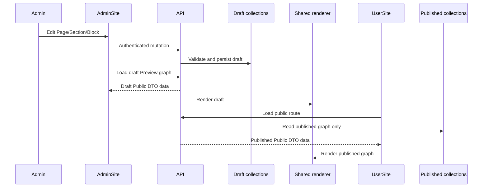
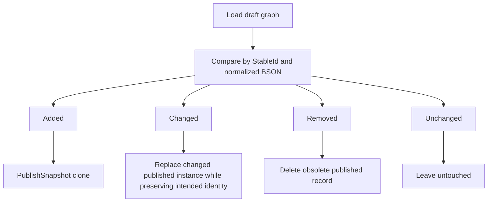
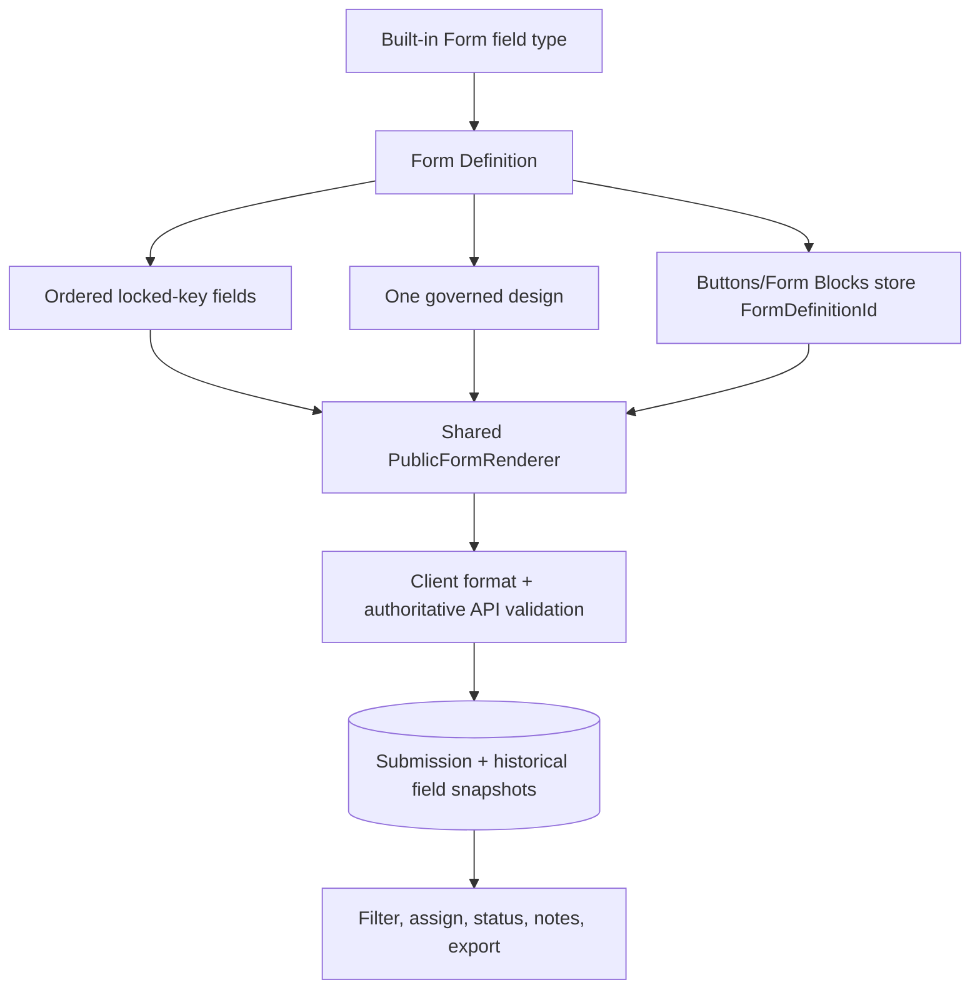

# Data Workflows And Invariants

Last reconciled: **2026-07-16**

## 1. Page Graph Identity

A rendered Page is a graph, not one document:

```text
Page
 |- ordered Sections by PageStableId
 |   |- Section-specific embedded items/slots
 |   \- ordered Blocks by SectionStableId
 |       \- governed descendants by ParentBlockId
 \- global Theme/Branding/Footer/Social/Button context
```

| Field | Meaning |
| --- | --- |
| `_id` / `Id` | Mongo document instance; may change across snapshot/clone operations. |
| `StableId` | Logical identity across draft/published/revision/clone meaning. |
| `PageStableId` | Parent Page graph identity. |
| `SectionStableId` | Parent Section graph identity. |
| `ColumnSlotId` | ColumnsSection slot ownership. |
| `ParentBlockId` | Nested ownership under a Container; currently parent document ID. |
| `SourceId` | Source document used for a snapshot. |
| `Version`, `PublishedAt`, `CreatedAt`, `UpdatedAt` | Workflow/history metadata. |

Every new relationship must be considered in publish diff, reset, clone profiles, revisions, presets, import, usage discovery, and deletion.

### Block peer scope

Block `Order` is local to:

```text
ParentBlockId + BlockZone + ColumnSlotId
```

Reorder requests must contain the complete peer set for one scope. Reorder never reparents a Block. Container membership cannot be changed by drag order.

## 2. Admin Preview, Edit, And UserSite



Admin Preview and UserSite must use the same Public DTO shapes and SharedComponents. If they differ, inspect both model-to-Public mappings before changing CSS.

## 3. Page Builder Interaction Model

### Global mode

- **Preview:** navigation and interactive draft view; users without `page-builder` stay here.
- **Edit:** Page/Section editing for users with `page-builder`.

Arrange is not a third global toggle state. It is entered from one selected Section's Blocks tab.

### Arrange workflow

1. Select a Section in Edit.
2. Open Blocks tab.
3. Resolve unsaved Section changes: save, discard, or cancel.
4. Enter Arrange Blocks for that Section.
5. Use the Section-scoped Block dropdown/list, Canvas zones, handles, and toolbar.
6. Use the content edit pencil for the selected Block when required.
7. Choose Done Arranging at any time. If an authoring operation is still completing, exit is queued and completed immediately afterward.
8. Return to the same Section, Blocks tab, and stable selected Block where possible.

Canvas/zone click targeting is authoritative during Arrange. A user does not need to exit Arrange to target another zone inside the same Section.

### Preview scale

- desktop logical width 1440 at 80% Canvas scale;
- tablet logical width 768 at 70%;
- mobile logical width 375 at 70%.

The shell width is calculated from scaled width so desktop should not create an unnecessary horizontal scrollbar. Tablet/mobile are width-based responsive previews, not device simulators.

### Page tab reveal

Selecting a clipped root Page tab scrolls only enough to reveal the complete selected tab and its actions. Already fully visible tabs do not move, and tabs are not forcibly centered.

## 4. Publish Workflow

The user publishes at Page level; the service writes granular graph differences.



Invariants:

- published Pages never read draft records;
- StableId meaning survives;
- serializer cloning retains normal new fields automatically;
- only identity/workflow fields are intentionally transformed;
- duplicate StableIds or graph integrity errors block publish;
- asset cleanup examines only replaced/deleted old records and still checks global references.

## 5. Reset And Revision

Reset:

1. load published Page/Sections/Blocks;
2. clone with `DraftResetSnapshot`;
3. regenerate draft instance IDs;
4. preserve stable graph relationships;
5. replace draft graph;
6. keep result editable, not published.

Reset destroys unpublished edits and requires confirmation.

Page and Content revision backends exist. Content history UI exists. Full Page
Revision History/preview/restore UI remains future. Restoring a revision creates
a new draft state; it never rewrites the historical record.

Before Page Revision History is promoted broadly:

- define whether revision snapshots guarantee asset recoverability;
- prevent cleanup from deleting a direct-upload asset that a retained revision
  is expected to restore;
- validate restored asset availability;
- emit a structured audit event;
- retain a before-restore snapshot;
- define revision pagination and retention rather than silently relying on a
  small fixed history window.

## 6. Section Preset Workflow

Saved Section presets are database-backed complete Section snapshots with associated Blocks where applicable.

```text
Section editor / Section edge action
    -> Save as Preset dialog
    -> name + description + source Section type/item summary
    -> PresetCapture clone
    -> canvas_section_presets
    -> Add Section > Saved Presets centered modal
    -> PresetApply clone with new identities
```

Rules:

- a preset is a saved reusable Section, not a Page template;
- it may contain normal Section content, images, items, and Blocks;
- assets remain references and participate in usage/deletion checks;
- applying regenerates graph identities and parent references;
- preset preview uses the original Section icon and metadata, not a generated screenshot;
- a misleading background-only or incomplete renderer snapshot must not return;
- preset outer hover animation and inner dark-blue icon outline are separate visuals.

## 7. Block Creation, Naming, And Geometry

### Creation

- Add Block opens one centered Canvas-owned modal even when invoked from a Section panel.
- Step 1 chooses type; Step 2 chooses a relevant starter only when the type has meaningful variants.
- Text has one starter.
- Form has no visual starter variants; it requires an active Form Definition.
- Database creation happens only after confirmation.
- freeform root Blocks are centered/clamped with small alternating offsets;
- flow Blocks append;
- Container children occupy governed next slots.

### Naming

- `EditorLabel` is private authoring metadata.
- Rename pencil is available in BlockEditor and Arrange content modal.
- Empty labels display `Untitled 1`, `Untitled 2`, etc., numbered by type for human naming while real list/order identity remains unchanged.
- public Text content never displays `EditorLabel` or legacy `Title` as content.

### Absolute geometry rule

- the authoring drag/resize outline represents the actual Block border;
- the selected overlay/handles may rise above overlapping rendered Blocks, but the rendered Block's layer is unchanged;
- rotation transforms renderer and outline together and updates continuously while press/holding rotation;
- Canvas empty-area clicks clear or retarget selection according to the active zone;
- generic Blocks do not auto-shrink their internal content to conceal bad geometry;
- FormBlock is a deliberate governed scaling exception.

## 8. Container Ownership And Layout

Container is a governed Block graph, not a temporary grouping operation.

Canonical presets include Stack, Row, Grid, Split, Orbit, Semi-circle, Advanced freeform, and compatibility-only Legacy freeform. Each preset specifies capacity, allowed child types, ordering policy, and named/fixed slots where required.

Invariants:

- no Group existing Blocks action;
- no Ungroup action;
- no parent reassignment or “move child to Canvas” action;
- children cannot move between Containers through ordinary APIs;
- nested Containers are blocked for new ordinary creation;
- API and UI both enforce capacity and allowed types;
- required fixed-slot children cannot be directly deleted;
- deleting a Container recursively counts and atomically deletes descendants;
- confirmation explains that descendants cannot be preserved;
- asset cleanup runs after graph deletion succeeds;
- old unknown/missing preset keys resolve to `legacy-freeform` for compatibility, but new legacy-freeform creation is rejected.

## 9. Responsive Composition

Normal behavior:

- root Blocks stack/reflow on narrow screens;
- grid/row layouts reduce columns;
- media, map, and Forms become full-width;
- collection Containers stack/reflow children;
- orbit/semicircle/diagram compositions use compact-preserve governance;
- Form desktop `FormScale` is ignored on mobile; the Form becomes full-width and natural-height.

Advanced responsive fields remain in persisted contracts for compatibility and preset governance even when not exposed in the normal BlockEditor.

## 10. Asset Paths

### Direct Upload

One-off field-owned asset:

- URL;
- storage key where available;
- source mode `DirectUpload`;
- no ResourceId.

It does not automatically appear in Resource Library.

### Managed Resource

Reusable governed asset:

- `ResourceId`;
- managed source marker;
- current URL;
- storage key for uploaded bytes;
- metadata/kind/Album.

The copied URL supports rendering compatibility; `ResourceId` is the precise governance reference.

## 11. Asset Replacement, Usage, And Cleanup

1. Save the new reference.
2. Capture old URL/key/ResourceId.
3. Search every known reference through asset/resource usage services.
4. Delete old bytes only when no live reference remains.
5. Hard-block Managed Resource deletion while used.
6. Treat R2 and future company storage through the provider boundary.
7. Include revision-retention policy when an old snapshot is expected to remain
   restorable.
8. Persist cleanup failures for retry or reconciliation instead of relying only
   on a warning log.
9. Provide a dry-run orphan scanner before destructive reconciliation.

Any new asset field absent from reference discovery is a release-blocking defect.

## 12. Resource Library Rules

- kinds: Image, Video, File;
- Video may be uploaded bytes or a deliberately validated YouTube video URL;
- YouTube playlists/channels/search URLs are rejected;
- Section background video must be a real upload/managed video, not YouTube;
- one Resource belongs to zero or one Album;
- no automatic Unsorted Album;
- Albums are organization, not usage ownership;
- Album deletion is blocked while non-empty;
- Resource deletion is blocked while referenced;
- bulk delete uses the same server checks;
- upload limits come from current Settings/policy, not documentation estimates;
- uploader display resolves a human name where possible.

## 13. Content Type Behavior

| Behavior | Meaning | Public action |
| --- | --- | --- |
| `Page` | Article/body content | Open Content detail Page. |
| `FileResource` | Primary file | Open/download file. |
| `VideoResource` | Uploaded/managed/supported video | Open media player/modal. |
| `ImageResource` | Primary image | Open image/lightbox. |
| `Gallery` | Image/video collection | Render gallery and media viewer. |

Content Page Preview renders only `Page` behavior. Resource-like content appears through lists/LibrarySection behavior rather than pretending to be an article.

## 14. Content Permissions And Workflow

### Assignable permission groups

- `view-content` — access Content Management;
- `create-edit-content` — create/edit own Draft/Rejected Content and includes View Content;
- `approve-content` — review/edit Submitted/Published Content and includes View Content.

Old `manage-content`, `publish-content`, and `delete-content` are migration-only keys and cannot be assigned again.

### Status representation

- **Draft** — normal editable draft;
- **Pending Review** — persisted as `ContentStatus.Submitted`;
- **Rejected** — new rejections use Draft plus `ReviewStatus=Rejected`; legacy `ContentStatus.Rejected` remains deserializable;
- **Published**;
- **Deleted**;
- `Archived` remains compatibility-only.

### Visibility scopes

| Scope | Writer/Create-Edit | Approver/Manager | AdminAdmin |
| --- | --- | --- | --- |
| All Content | published content; no other writers' drafts | all non-deleted/non-archived | all non-deleted/non-archived |
| My Content | own Draft, Submitted, Rejected, Published | own supported statuses | own supported statuses |
| Submitted | own Submitted | all Submitted | all Submitted |
| Published | own Published | own Published | own Published |
| Deleted | hidden | hidden | all Deleted |

Deleted items never also appear in My Content.

### Actions

| State | Owner with Create/Edit | Approver | AdminAdmin |
| --- | --- | --- | --- |
| Draft | edit, save, submit, delete own | no other-writer draft edit | edit, save, direct publish, delete |
| Submitted | read own; withdraw to Draft before editing; cannot delete | edit, publish, reject | edit, publish, reject, withdraw/force Draft, delete |
| Rejected | edit own; save returns normal Draft; then submit again; delete own | read according to review scope | edit/delete/force transitions |
| Published | read/preview; no edit/delete | edit, return to Pending | edit, return Pending or force Draft |
| Deleted | unavailable | unavailable | read-only, restore to Draft, or permanently delete |

Only Published Content exposes public Content Preview. Status transitions are explicit workflow commands, not a raw status dropdown for ordinary users.

Author ownership is stored by Admin ID. UI mapping resolves a human full name; it must not show ObjectId hashes or email when a known name exists. Legacy email ownership comparison remains only for compatibility.

## 15. Roles, Account Permissions, And Session Impact

### Role model

- AdminAdmin: protected, system, always all assignable permissions;
- Manager/Writer/Viewer: seeded defaults only when role collection is empty; afterward editable/deletable;
- custom roles: name, description, mandatory permission set.

Effective user permission:

```text
Role.Permissions
    UNION
User.ExtraPermissions
    EXPAND dependency graph
```

Role permissions appear locked for an assigned user; an Admin can add extras but cannot remove the role's mandatory permissions from that account. Deleting a role with users requires an explicit replacement role and updates all affected users atomically enough to avoid role-less accounts.

### Dependency graph

- Create/Edit Content -> View Content;
- Approve Content -> View Content;
- Edit Form Definitions -> View Form Definitions;
- Manage Form Submissions -> View Form Submissions;
- Export Form Submissions -> View Form Submissions.

### Admin-exclusive capabilities

These are descriptive full-Admin powers, not assignable checkboxes:

1. manage Content configuration/types;
2. view/edit any Draft;
3. directly publish a Draft;
4. force Content back to Draft;
5. delete any eligible Content;
6. view Deleted Content;
7. restore Deleted Content;
8. permanently delete Content;
9. manage Content workflow/revision history;
10. manage role definitions;
11. manage protected Admin accounts.

### Security mutation effects

Disabling, deleting, password-resetting, role-changing, or permission-changing an account increments token/session validity state and revokes relevant sessions. The AdminSite invalidates active circuits immediately within one process and revalidates against API at most every 30 seconds.

Protection of the last active AdminAdmin account must be based on its true protected role, not old enum ordinals or a missing legacy role field.

## 16. Admin Authentication Workflow

1. Browser GETs server-rendered `/login` Razor Page.
2. Page loads public Admin appearance and active Admin-enabled language list from API.
3. POST submits credentials with antiforgery token.
4. API login limiter applies by IP.
5. API checks BCrypt, status, lockout, role, and creates DB session/JWT.
6. AdminSite validates returned JWT metadata and writes encrypted Secure/HttpOnly/SameSite cookie.
7. JWT remains a private protected ticket claim.
8. Blazor `HttpService` reads the server principal and forwards Bearer token to API.
9. API validates JWT, token version/session, and endpoint permission.
10. Logout/401/revocation uses full-page sign-out and deletes the cookie.

Authentication localStorage is forbidden. Temporary migration cleanup may delete the old `admin_session` key; language preferences may still use localStorage.

Admin login/logout are full-page navigation because cookie headers are an HTTP response concern, not an in-circuit JavaScript storage action.

## 17. Form Definition, Design, Block, And Submission Workflow



### Definition invariants

- Form Key is unique and locked after creation;
- Form Definition display order is persisted and server-authoritative;
- authorized whole-row drag ordering uses revisioned conflict protection;
- duplicate creation rejects instead of merging;
- Field Key and Field Type lock after first save;
- type/key change requires delete + new field;
- current definition is the public allowlist;
- deleted fields remain only in old submission snapshots;
- definition deletion is blocked while referenced;
- recreated textual key never reconnects old ID references silently;
- active/inactive is respected by public lookup.

### Design invariants

- exactly one design per definition;
- accepted v2 outer layouts: Standard, Split Panel, CTA;
- v1 Stacked/Two Columns/CTA algorithms remain compatibility input, not the
  current authoring contract;
- outer layout is independent from explicit field rows;
- every active field appears exactly once in one row;
- one row contains one to three compatible fields;
- wide fields default to their own row;
- mobile stacks every persisted desktop row to one column;
- Split Panel owns an information surface and a Form surface with independent colors and a governed divider ratio;
- optional localized information items model icon/text/action rows without HTML;
- exactly one semantic Submit action remains mandatory;
- up to three auxiliary link/file/phone/email actions may be governed separately and can never become accidental Submit actions;
- modal/embedded is usage context, not a design toggle;
- width is drag-edited and layout-clamped; Split Panel also exposes a governed divider handle;
- height is calculated from localized headings, explicit field rows, information items, actions, labels, independent spacing, reserved validation/status space and the taller Split side;
- field-row spacing is 1–16px in v2 and does not control label/header/button/validation spacing;
- maximum definition height is 1800px; too-tall save rejects;
- design save propagates Form Block baselines to draft/published collections with rollback;
- propagation never resizes non-Form buttons/cards that happen to store `FormDefinitionId`.

### Authoring invariants

- existing-definition navigation preserves Content or Form Design;
- New Form begins on Content;
- dirty navigation requires Save, Discard or Cancel;
- the definition rail exposes at most six rows before scrolling;
- the whole definition row is draggable, but click remains selection and order persists through an authorized API operation;
- Live Preview is first in Form Design;
- Design Settings opens a scrollable Theme-style drawer over the definition rail and never pushes the preview;
- grouping/ungrouping fields updates the preview immediately but persists only through Save Definition.
- row order is changed by dragging the row surface;
- fields within one row can be reordered by dragging;
- dragging a field outside its row creates a new row;
- grouped fields remain an explicit row until the user ungroups or moves them;
- Reset restores the last saved definition state.

### FormBlock invariants

- selects one active definition;
- owns no field list, independent submit label, or shape variant;
- initial width/height equals definition design within Section available width;
- maximum scale 100%, minimum 50%; width/height resize together;
- resize stops at 50%; it does not pass the threshold and later block enlargement;
- all fields/buttons remain in scaled content;
- Section may grow downward only, capped at 3000px;
- mobile renders full width/natural height without desktop transform scaling;
- authoring rename changes only `EditorLabel`.

### Public renderer invariants

- embedded and modal output uses `PublicFormRenderer`;
- real labels remain for accessibility;
- inside-input labels are visually hidden only where appropriate;
- textarea/checkbox labels stay visible;
- error/status areas reserve layout space;
- public submit sends only current definition fields and allowed metadata;
- missing/inactive definition produces explicit unavailable state.

## 18. Language Workflow

### Configured languages

Language Settings controls active, Admin-enabled, User-enabled, order, names/native names/direction, and system fallback. Content dictionaries may include languages without an Admin UI catalog.

Compiled Admin UI catalogs currently exist for:

- `en` — English;
- `vi` — Vietnamese with proper diacritics;
- `cn` — Chinese.

Japanese or future Spanish can be enabled and shown in login/Admin selectors without a compiled catalog; their UI text falls back according to policy.

### Lookup and validation

```text
requested language
    -> configured fallback language
    -> raw translation key
```

The fallback/key language is system-wide and changes only through Language Settings, not when one user changes their dropdown.

Translation Health checks:

- missing fallback catalog (critical);
- fallback missing/empty keys (critical);
- duplicate declarations (error);
- secondary missing/empty keys (warning);
- enabled language without compiled catalog (unsupported/grey);
- coverage count and expandable issue lists.

It is read-only. Fix source catalogs and redeploy. No automatic translation, database override, or runtime source modification exists.

### Login language

The login dropdown reads every active Admin-enabled language from the public Settings endpoint. EN/VI/CN have compiled login labels. Unsupported languages display in the list but use configured fallback UI text. Successful login preserves the selected UI language as a non-secret preference; it does not change the system fallback.

## 19. Immediate Feedback Workflow

API responses may carry:

- `Success`;
- `StatusCode`;
- human fallback `Message`;
- `NotificationKey`;
- `NotificationArgs`.

Admin feedback resolves localized key first, then fallback message.

Default severity:

- 2xx: success;
- 400/404/409/422: warning;
- 401/403: warning plus auth/permission handling;
- other failures/5xx/no response: error.

Display modes:

- **Toast** for important discrete feedback;
- **Inline** near a repetitive control/progress surface;
- **Silent success** for routine operations while still surfacing failure;
- **Modal** exists as a message contract value but is not a general persistent system.

Toast host caps visible notifications at three, times them out after four seconds, and removes them on navigation. No dedupe/throttle suppresses accurate independent events.

This workflow is not persisted and cannot notify an offline user.

## 20. Theme, Font, And Style Precedence

```text
Theme variables + body/heading fonts
    -> Section style/background/spacing/content-width
    -> Block appearance/font override
    -> semantic component CSS
    -> retained HTMLSection page-family CSS where applicable
```

Theme controls header colors, Section Theme background, body font, heading font, and size scale. Text Block may inherit or override with an allowlisted font. Arbitrary font-family input is not accepted.

## 21. UserSite Header Workflow

- top threshold: header surface transparent, controls unchanged and visible;
- downward travel beyond threshold: entire header slides upward out of view;
- upward travel: header slides down;
- absolute top always wins and reveals header;
- responsive mobile menu retains an opaque usable surface when open.

## 22. Database Import Workflow

Demo Import is import-only:

- fixed target `FullProjectDb-UIWEB-3`;
- exact database can be dropped/recreated when configured;
- reserved DBs and non-target names rejected;
- allowlisted content/UI collections only;
- no sessions, login activity, audit, submissions, metrics, or revisions;
- demo Admin created separately;
- asset bytes are not duplicated; URLs may still point at existing R2 objects.

The current active database and official seed can diverge. Refresh the seed only after an accepted data migration and explicit user decision.
