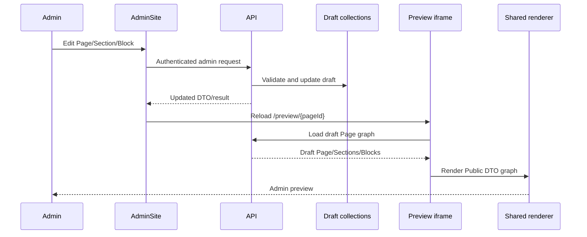
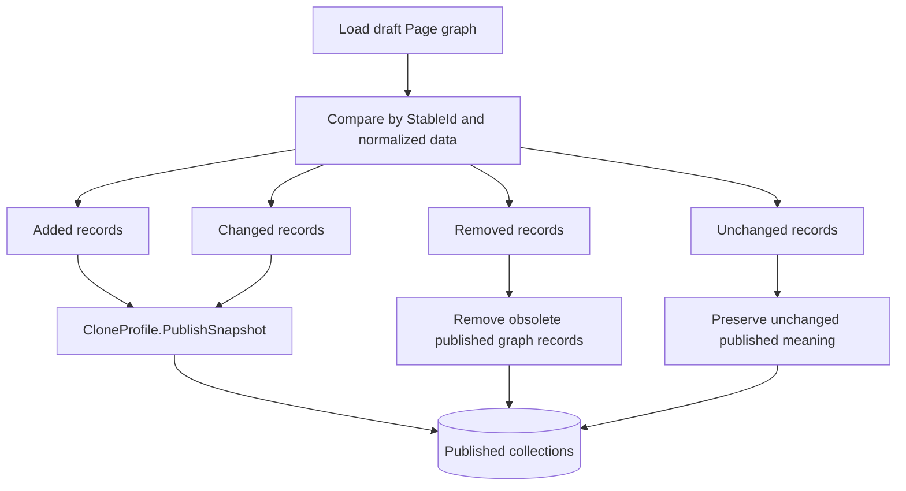
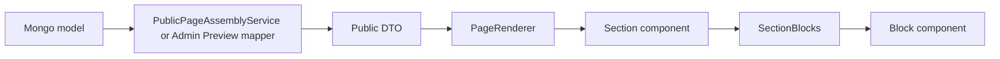
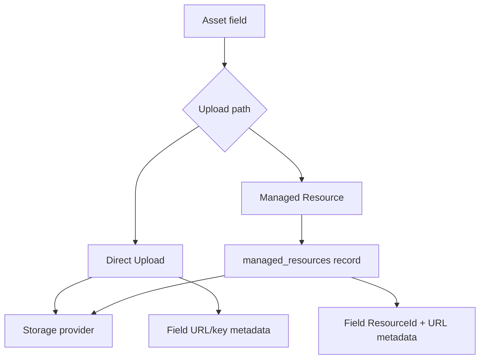
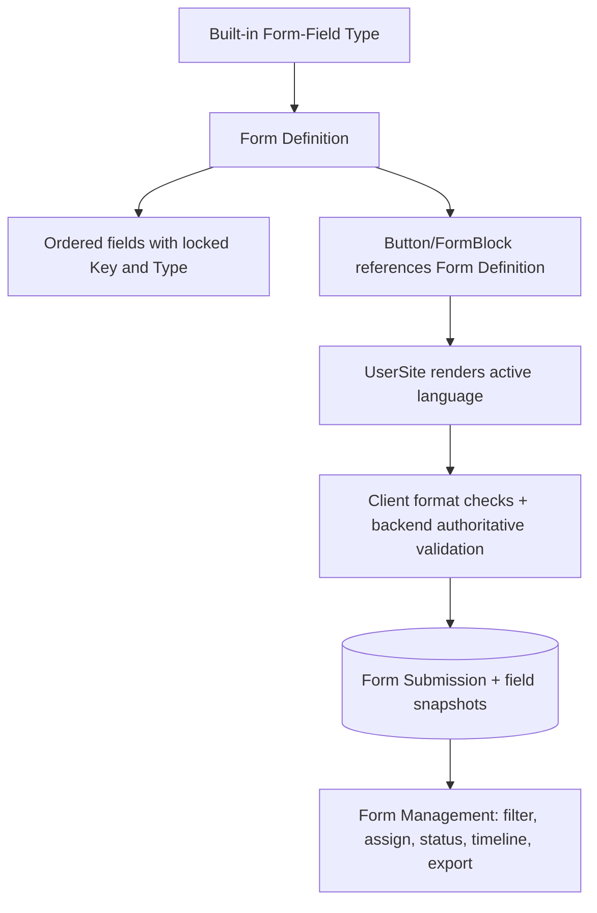

# Data Workflows And Invariants

## 1. Page Graph Identity

A Page is not one MongoDB document. Its rendered graph is:

```text
Page
 |- Sections ordered by PageStableId + Order
 |   |- Section-specific items
 |   |- ColumnSlots where applicable
 |   \- Blocks ordered by SectionStableId + Order
 |       \- nested Blocks linked by ParentBlockId
 \- global Theme/Branding/Footer/Social/Button context
```

Identity fields have different meanings:

| Field | Meaning |
| --- | --- |
| `_id` / `Id` | Mongo document instance. It may change across clone profiles. |
| `StableId` | Logical Page/Section/Block identity across draft, published and revisions. |
| `PageStableId` | Parent Page graph identity. |
| `SectionStableId` | Parent Section graph identity. |
| `ColumnSlotId` | ColumnsSection slot ownership. |
| `ParentBlockId` | Nested Block ownership under a Container. This currently refers to the parent document ID. |
| `SourceId` | Source document used to create a snapshot. |
| `Version`, `PublishedAt`, `UpdatedAt` | Workflow and history metadata. |

Any new graph relationship must be covered by clone, publish diff, reset, preset capture/apply and importer verification.

Block `Order` is meaningful within a peer scope, not across the whole Section. The current peer identity is:

```text
ParentBlockId + BlockZone + ColumnSlotId
```

Reorder requests must contain the complete peer set for exactly one scope. The API rejects partial, duplicate, missing or mixed-scope requests. Drag ordering never reparents a Block or moves it to another zone/slot.

Default freeform placement is service-owned: a new freeform Block is centered and clamped using its starter geometry, with a small alternating offset for later peers. Flow Blocks append within their peer scope. A Container child follows its Container layout and defaults to flow unless that Container explicitly uses freeform layout.

## 2. Edit And Preview Workflow



Admin Preview loads draft data. UserSite loads published data. A change visible in the editor but not after reload usually means the save did not persist, the wrong draft record was addressed, or preview data mapping omitted the field.

## 3. Publish Workflow

The user still publishes at Page level. Granular behavior is internal.



Important invariants:

- Stable identity is preserved.
- Published Mongo IDs are snapshot instances, not draft IDs.
- New model fields should automatically survive serializer cloning.
- Identity/workflow fields are the only intentionally transformed data.
- Public Pages never read drafts.

## 4. Reset Workflow

Reset restores published graph data into draft:

1. Load published Page, Sections and Blocks.
2. Clone with `DraftResetSnapshot`.
3. Regenerate draft document IDs as required.
4. Preserve StableIds and relationships.
5. Replace the editable draft graph.
6. Keep the result as draft, not published state.

Reset can destroy unpublished edits. The UI must require deliberate confirmation.

## 5. Revision Workflow

Page and Content revision models/services exist.

- Content revision UI is established.
- Page revision backend exists.
- Administrative Page Revision History UI remains a planned feature.
- Restoring a revision must create a new draft state; it must not rewrite historical records.
- Revision retention should be displayed and governed, not silently deleted.

## 6. Section And Block Rendering

API/admin preview/public assembly maps Mongo models to Public DTOs. SharedComponents renders those DTOs.



When a field works in UserSite but not Admin Preview, compare the two model-to-Public-DTO mapping paths before changing CSS.

## 7. Responsive Composition

Current contracts support desktop layout, tablet/mobile overrides, layout modes, shapes, freeform geometry and Container responsive modes.

The newly agreed UX direction simplifies what normal administrators see:

- ordinary root Blocks stack automatically on narrow screens;
- grid/row layouts reflow automatically;
- media, map and forms become full width;
- Collection Containers stack children;
- orbit/semicircle/diagram Containers behave as one compact-preserve composition;
- advanced overrides remain stored for compatibility and governed presets.

Do not delete old responsive fields merely because the normal UI stops exposing them.

## 8. Asset Paths

### 8.1 Direct Upload

Use for one-off assets owned by a specific field, such as a Section background or decorative Block image.

Stored data typically includes:

- URL;
- storage key where available;
- source mode `DirectUpload`;
- no ResourceId.

Direct uploads do not automatically appear in Resource Library.

### 8.2 Managed Resource

Use for reusable images, files, real videos and deliberate YouTube video records.

Stored reference metadata includes:

- `ResourceId`;
- `ResourceSource` / managed source marker;
- current URL;
- storage key for uploaded assets;
- file metadata.

The URL may be copied for rendering compatibility, but ResourceId is the precise governance reference.



## 9. Asset Replacement And Cleanup

Replacement does not immediately assume the old URL is disposable.

1. Save the new asset/reference.
2. Gather the old URL/storage key.
3. Search all supported references through `AssetReferenceService` and resource usage services.
4. Delete the old binary only when no live reference remains.
5. Keep managed Resource deletion hard-blocked while used.
6. Treat R2 and future local storage through the same provider boundary.

Any new asset-bearing field must be added to reference discovery. Otherwise the cleanup service can undercount usage and delete a still-used asset.

## 10. Resource Library Rules

- Resource kinds are Image, Video and File.
- Resource Library videos may be real uploads or a deliberate YouTube external-link exception.
- Playlist, channel and search URLs are rejected; supported complete YouTube video URLs are normalized.
- Section background video is a real uploaded video, not YouTube.
- Albums are folder-like organization, not usage constraints.
- One Resource belongs to zero or one Album.
- Media albums contain Image/Video; File albums contain File.
- Resources do not need an Album.
- No automatic "Unsorted" Album exists.
- Album deletion is hard-blocked while it contains Resources.
- Resource deletion is hard-blocked while used anywhere.
- Bulk delete follows the same server checks as individual delete.
- Current default limits are approximately Image 20 MB, File 50-100 MB according to configured policy, and Video 250 MB; the actual authoritative values come from Resource Library settings and upload policy.
- Only authorized Admin users can change upload limits.
- Uploaded-by display uses a human name where available, not a raw database ID.

## 11. Content Type Behavior

| Behavior | Required meaning | Public action |
| --- | --- | --- |
| `Page` | Body/page content | Open Content detail Page. |
| `FileResource` | Primary managed/direct file | Open file in a new tab. |
| `VideoResource` | Uploaded/managed video or supported external video | Open media player/modal. |
| `ImageResource` | Primary image | Open lightbox/modal. |
| `Gallery` | Image/video collection | Display gallery and open media viewer. |

Content Page Preview must render only `Page` behavior. Resource content is monitored from Content lists and rendered through LibrarySection/Resource Library behavior.

## 12. LibrarySection Workflow

LibrarySection reads Content Types and behavior, not arbitrary Resource Library inventory.

- Content Management chooses which editorial records are public.
- Resource Library governs a broader reusable asset pool.
- A Content file can reference the same managed Resource without the two modules becoming duplicates.
- File opens new tab.
- Image opens lightbox.
- Video opens the Section playlist modal when multiple videos belong to that Section.
- Gallery uses horizontal/gallery presentation with media interaction.
- Existing layouts remain Card, Grid, Rows, List and Gallery.

## 13. Form Definition And Submission Workflow



Form invariants:

- Form Key is unique and sticky after creation.
- Creating with an existing Form Key must reject, never silently merge.
- Field Key is manually chosen from governed suggestions or created intentionally.
- Key suggestions exclude keys already used in the same Form.
- Field Key and Field Type lock after first save.
- Change Type/Key by deleting the field and creating a new one.
- Deleting a saved field requires warning; old submissions retain historical field snapshots.
- A Form Definition cannot be deleted while any button or Block uses it.
- Deleting a Form clears/requires re-selection of its action reference; recreating the same textual key must not silently reconnect old references.
- Public submission accepts only fields in the current definition.
- Metadata such as honeypot/source is not treated as a user Form field.

## 14. Authentication And Authorization

Current login flow:

1. Admin submits credentials through an antiforgery-protected Razor Page.
2. API rate-limits login by IP.
3. AuthService verifies BCrypt password and user status/lockout.
4. API creates a database session and JWT containing role/permissions/token version.
5. AdminSite validates the response and creates an encrypted Secure/HttpOnly/SameSite session cookie. The JWT is a private claim inside that protected ticket, not browser storage.
6. Server-side HttpService reads the authenticated principal and sends the Bearer token to the API. Browser JavaScript never receives it.
7. API JWT validation checks signature, issuer, audience and lifetime.
8. `AdminSessionValidationMiddleware` verifies the database session/token state.
9. Controller policy checks role/permission.
10. API 401 responses, account mutations and 30-second periodic revalidation invalidate the Blazor circuit and submit an antiforgery-protected cookie sign-out.

Roles:

- **AdminAdmin:** bypasses ordinary permission lists and has full administrative authority.
- **Manager:** content publishing/deletion and Form Management defaults.
- **Writer:** content creation/editing defaults, Form Management defaults, Resource Library access; no unrestricted system management.
- **Viewer:** preview/read-oriented access; explicitly excluded from Form Management and Resource Library.

Authentication does not read or write `localStorage`. Two temporary cleanup statements only delete the former `admin_session` key during migration. Immediate cross-circuit invalidation uses an in-process event bus and therefore assumes one IIS worker; API rejection plus periodic revalidation remains authoritative. Persist and protect the configured Data Protection key ring so cookies survive recycle and deployment.

## 15. Language Workflow

- UserSite language lives in `LanguageService` and `localStorage["lang"]`.
- Language settings come from API and identify active/user-enabled/fallback languages.
- Blazor publishes the active language to JavaScript so modal forms use the same source of truth.
- JavaScript fallback order is intended to be active Blazor language, document language, parsed localStorage, then configured fallback.
- Public Form Definition labels, introduction, fields and submit label are resolved from the active language.
- English is current fallback, but fallback ownership must be configurable so Vietnamese can become primary later.
- Translation Health is future read-only reporting; it does not auto-translate.

## 16. Theme And Style Precedence

```text
Global Theme variables
        v baseline
Section Style overrides
        v local background/layout/text behavior
Block Appearance overrides
        v local frame/media/shape behavior
Component semantic CSS
        v final rendering
```

Theme must control navigation color and the Section `Theme` background option. Section/Block overrides should not be overwritten by later Theme saves.

## 17. Database Import Workflow

The Demo Import Tool is import-only.

- Target database is hard-locked to `FullProjectDb-UIWEB-3`.
- It can create the database automatically; the tester does not pre-create it.
- With `DropExistingTargetDatabase=true`, it replaces only that exact database.
- It refuses MongoDB reserved databases.
- It imports an allowlisted set of UI/content collections.
- It excludes submissions, metrics, revisions and operational logs.
- It creates a demo Admin user separately.
- It writes import metadata.
- It does not duplicate R2 objects; imported URL metadata points to the existing asset URLs.

The application must use the same database name in its API configuration after import.
