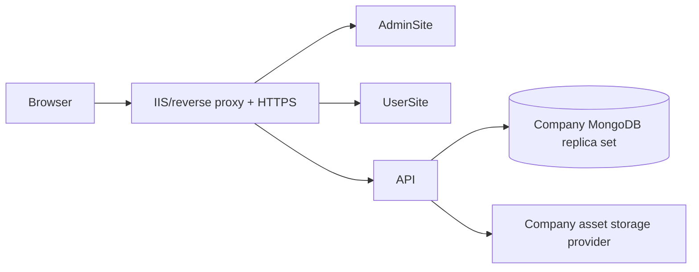

# Development Operations And Security

## 1. Local Runtime

Default HTTPS endpoints:

| Application | URL |
| --- | --- |
| AdminSite-API | `https://localhost:6969` |
| AdminSite-Frontend | `https://localhost:7152` |
| UserSite | `https://localhost:7113` |

Recommended startup order:

1. MongoDB replica set.
2. AdminSite-API.
3. AdminSite-Frontend.
4. UserSite.

The API configuration determines MongoDB database, JWT settings, CORS origins, seed behavior, upload/storage configuration and Form security limits.

## 2. Build Commands

From the repository root:

```powershell
dotnet build AdminSite-API\Main-API.csproj --no-restore
dotnet build AdminSite-Frontend\AdminSite.csproj --no-restore
dotnet build UserSite\UserSite.csproj --no-restore
dotnet build SharedComponents\SharedComponents.csproj --no-restore
dotnet build Contracts\Contracts.csproj --no-restore
git diff --check
```

JavaScript syntax checks when corresponding files change:

```powershell
node --check AdminSite-Frontend\wwwroot\js\canvas.js
node --check AdminSite-Frontend\wwwroot\js\overlay.js
node --check SharedComponents\wwwroot\cms-widgets.js
node --check SharedComponents\wwwroot\block-animations.js
node --check SharedComponents\wwwroot\block-diagrams.js
```

## 3. Git And Branch Discipline

- Active feature branch at this handoff: `Indev3-Overhaul3`.
- Integration branch: `Indev-3`.
- `Indev3-FormOverhaul-3` was merged into `Indev-3`.
- `codex/logs-overhaul` exists but Log Overhaul is deferred.
- Do not assume local and origin branches are synchronized.
- Never reset a dirty worktree without explicit approval.
- Before commit, review `git diff --stat`, `git diff --check` and targeted diffs.
- Keep database-only test content out of source commits unless a seed refresh is explicitly intended.

## 4. Tool Ownership

### User-Operated Tools

`Tool` contains explicit utilities a human tester may run:

- Demo database importer;
- Page graph clone coverage/testing tool.

### AI/Developer Maintenance Tools

`AI-Tools` contains:

- database audits;
- backup helpers;
- one-off seed/update scripts;
- BlockOverhaul inventory export;
- temporary migration helpers.

Do not replace `Tool/Tool For Demo Import` when synchronizing only the five main application folders to SVN.

## 5. Demo Database Import

The user-facing entry point is the batch/executable under:

```text
Tool\Tool For Demo Import
```

Important safety properties:

- hard target name `FullProjectDb-UIWEB-3`;
- reserved Mongo databases rejected;
- only allowlisted collections imported;
- operational collections blocked;
- target replacement is explicit configuration;
- failure should leave other cluster databases untouched.

After importing, configure AdminSite-API to use the imported database name. The user does not need to create the database manually.

## 6. SVN Synchronization

The company SVN working copy historically lives under:

```text
F:\0-Project\Test1\ProjectInSVN\UIWEB
```

When explicitly asked to update it:

- synchronize only the relevant application folders;
- exclude `.git`, `.vs`, `bin`, `obj`, build artifacts and AI-Tools;
- preserve the SVN copy's Demo Import Tool folder unless the user explicitly requests tool replacement;
- compare changed files before copying;
- build from the SVN copy afterward.

TortoiseSVN is a shell client. VisualSVN is the Visual Studio extension/server family; they are not interchangeable names.

## 7. Authentication Security: Current Measures

Implemented:

- BCrypt password hashes;
- JWT issuer, audience, lifetime and signature validation;
- minimum JWT secret length check;
- database-backed Admin session validation;
- token/session revocation concepts;
- role and permission claims;
- fallback policy requiring authentication;
- backend authorization on admin controllers;
- Viewer exclusions from Form Management;
- login rate limiting;
- account status and lockout fields;
- CORS origin restrictions;
- logout endpoint and local session removal.

Important limitation:

- AdminSite stores the JWT-bearing `admin_session` object in browser localStorage.
- This survives refresh and is convenient, but any successful XSS in the Admin origin can read it.
- Backend checks prevent UI hiding from becoming authorization, but a stolen valid token remains valuable until expiry/revocation.

Planned correction: Secure, HttpOnly, SameSite cookie authentication plus CSRF-aware request design.

## 8. Upload Security: Current Measures

Implemented layers:

- authenticated/authorized upload endpoints;
- per-kind size limits;
- extension allowlists;
- MIME checks;
- file-signature/magic-byte checks;
- kind validation;
- sanitized storage paths/keys;
- centralized resource validation;
- managed/direct source normalization;
- usage-aware deletion;
- replacement cleanup only after reference checks.

Not yet implemented:

- antivirus/deep scanning;
- quarantine state;
- archive extraction limits;
- decompression-bomb detection;
- asynchronous scan status;
- automatic rejected-file cleanup.

Do not describe current upload handling as "antivirus protected."

## 9. Form Security

Implemented:

- definition-driven allowlist;
- maximum field count;
- maximum payload characters;
- field-specific length/format validation;
- email, phone and numeric rules where applicable;
- honeypot metadata;
- cooldown and duplicate-submission window;
- HTML/script rejection/sanitization policy;
- backend authoritative required-field rules;
- deleted fields ignored as current schema and rejected if submitted as unknown user fields;
- rate limiting on public form routes.

Captcha mode currently supports configuration but may be off. Do not claim CAPTCHA protection unless enabled in the active environment.

## 10. Content And HTML Security

- Rich/public HTML passes through sanitization and URL policy checks.
- External URL schemes are constrained.
- YouTube video URL handling uses shared validation/normalization.
- HTMLSection content must not contain executable scripts.
- Page-family CSS remains source-controlled.
- CSP/security-header review is still future work.

Any new rich HTML input must explicitly identify where sanitization occurs.

## 11. Asset And Resource Safety

- Resource deletion is blocked by live usage.
- Album deletion is blocked while Resources remain.
- Form deletion is blocked while referenced.
- Asset cleanup searches references before physical deletion.
- New asset fields must be added to both precise ResourceId and URL fallback usage detection.
- Direct Upload cleanup and Managed Resource deletion use related but different ownership rules.

The central danger is a new field that stores an asset but is absent from reference discovery. Treat that as a release-blocking gap.

## 12. MongoDB Indexes

`MongoIndexService` creates indexes at startup. Index creation failure logs a warning and allows the application to continue, potentially with slow queries.

Important index families include:

- user email uniqueness;
- page/content stable identity and lookup;
- Form keys;
- Managed Resource kind/active, AlbumId;
- Resource Album scope;
- workflow/list query fields.

MongoDB considers key pattern and options when detecting duplicates. If an equivalent index already exists under another name, creating the same pattern with a new name can fail. Index code should inspect/reconcile existing definitions rather than assuming only the desired name matters.

## 13. Secrets And Configuration

Never copy secret values into documentation or commits.

Production/company deployment should supply through environment-specific configuration or a secret manager:

- JWT secret;
- MongoDB credentials;
- R2 or local storage credentials;
- CORS origins;
- service account details;
- TLS/private keys.

Sample/demo credentials must be clearly marked, changed outside local testing, and never reused for real accounts.

## 14. Company Deployment Direction

Information still required from the company:

- MongoDB host/port/replica set;
- authentication database and credentials;
- TLS requirements;
- backup/restore policy;
- Windows service, IIS, reverse proxy or container hosting model;
- storage root and quota;
- public/private asset URL strategy;
- filesystem service account permissions;
- SVN release workflow;
- log retention and monitoring.

Expected architecture:



Do not migrate R2 data until the storage URL model and company access pattern are known.

## 15. Testing Strategy

Current testing is a mix of:

- builds;
- JavaScript syntax checks;
- database audits;
- explicit clone coverage tool;
- manual Admin Preview/UserSite tests;
- direct MongoDB inventory queries.

Missing infrastructure:

- automated API integration tests;
- browser regression suite;
- CI pipeline;
- automated importer verification;
- automated responsive screenshots;
- automated database index compatibility checks.

For high-risk changes, verify at least:

1. create/edit/reload;
2. preview;
3. publish;
4. UserSite;
5. reset;
6. clone/preset where applicable;
7. old documents;
8. permissions;
9. mobile;
10. deletion/cleanup.

## 16. Troubleshooting Map

| Symptom | First areas to inspect |
| --- | --- |
| Admin Preview differs from UserSite | Admin `Preview.razor` mapping vs `PublicPageAssemblyService`, then SharedComponents. |
| Change disappears after reload | API save result, draft identity, DTO mapper, correct page/section/block IDs. |
| Preview says reconnecting | Blazor circuit log, iframe render exception, API deserialization error. |
| Page shows only some Sections | API request failure, polymorphic deserialization, preview circuit exception. |
| `ParentBlockId` BSON type error | Old ObjectId-vs-string data and serializer compatibility/migration. |
| Resource cannot delete | Usage endpoint/reference list; this is normally intentional. |
| Old asset remains in R2 | Reference still exists or cleanup provider did not receive a valid storage key. |
| Form required field persists after deletion | Current Form Definition validation path and stale hard-coded JS payload fields. |
| Vietnamese Form labels absent | UserSite active language exposure to JS and Form Definition dictionary mapping. |
| Index already exists under another name | Compare Mongo index key/options before creating desired named index. |
| Block drag handle does nothing | BlockEditor sortable initialization; current UX audit confirmed this gap. |
| Mobile preview differs from phone | viewport width/height, media queries, device pixel ratio, touch/browser chrome and preview scale. |

